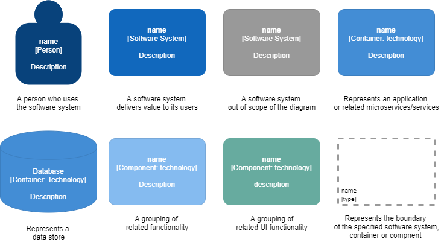
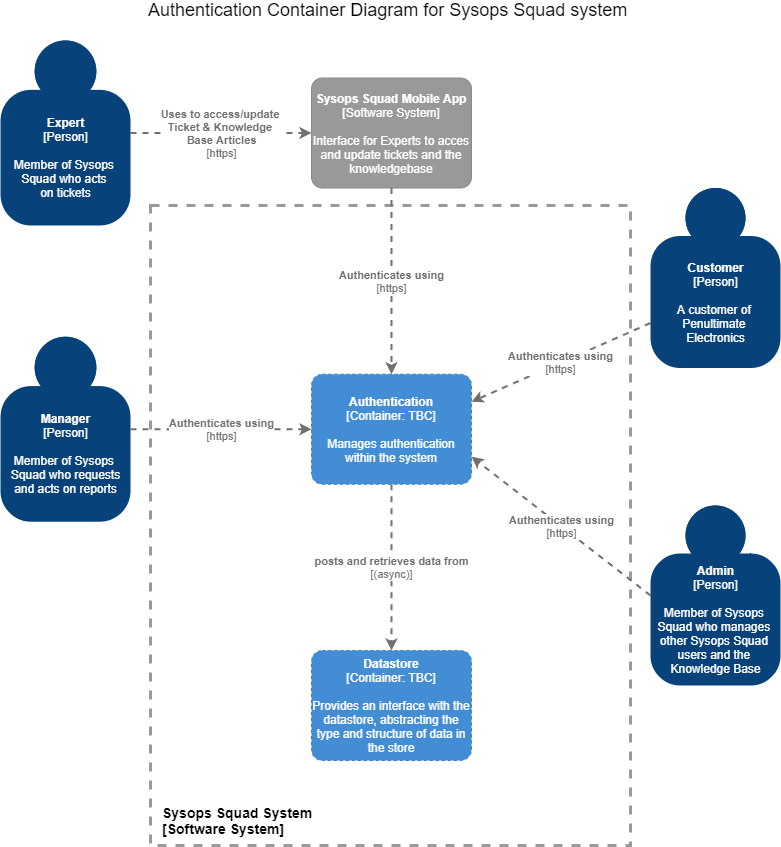
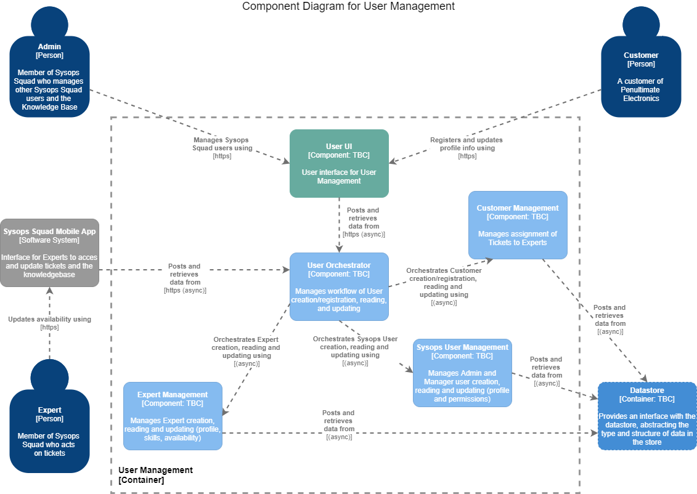
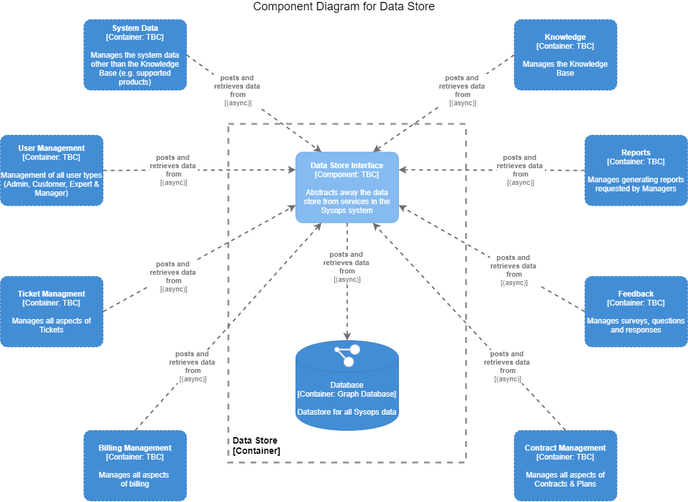
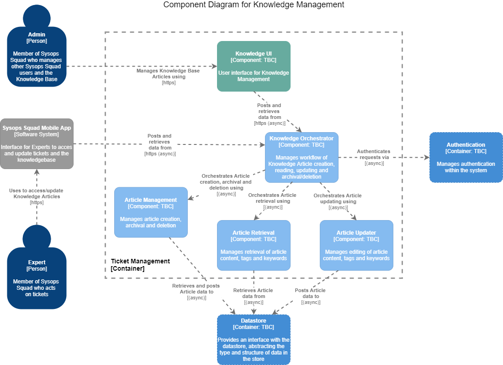
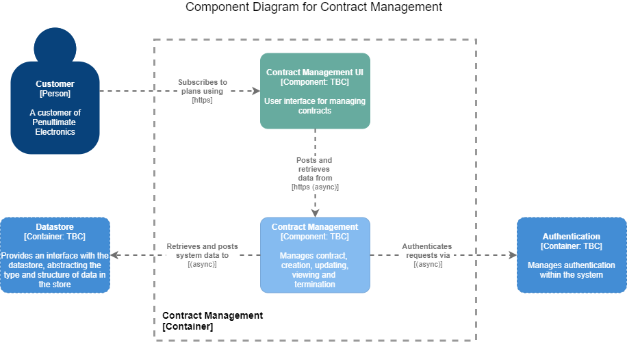

# C4 Infrastructure Models

A C4 model is a common set of abstractions to create used to describe the static structure of a software system; these abstractions having four levels: **software system**, **containers**, **components** and **code**. **People** use the software system.

The following diagrams use the standard C4 notation, with the addition of a different colour to highlight a UI Component, as opposed to a back-end component, in our micro front-end ([see ADR: 003 We-will-use-a-Micro-Frontend-architecture](../../4.ADRs/003We-will-use-a-Micro-Frontend-architecture.md)).

## C4 Model Key

## Context Diagram (Level 1 - top level)

A **System Context** diagram provides a starting point, showing how the software system in scope fits into the world around it.[^](#expl) 
This diagram shows how the main users of Sysops Squad interact with the system, and the other systems that the Sysops Squad system interacts with.

------

## Container Diagram (Level 2)

A **Container** diagram zooms into the software system in scope, showing the high-level technical building blocks.[^](#expl)
The following diagram breaks down the Sysops Squad system into groups of related functionality, or domains, and shows how they interact with each other and how the users of the Sysops system interact with the functionality.

### Overall Sysops System

Authentication has been left of out this diagram for readability. See Authentication container diagram below.

### Sysops System Authentication

Every service within the Sysops Squad system can use the Authentication domain where needed, but is not shown on the below diagram for readability. Having a single source of truth for authentication allows the Sysops Squad system to be built on the premise of Zero Trust. When a request is made to a service it will not be assumed that the request is from a genuine authenticated user, but checked against the authentication domain, e.g. by sending a token.

#### Relevant ADRs

- [011 We-will-use-zero-trust-architecture](../../4.ADRs/011We-will-use-zero-trust-architecture.md)

------

## Component Diagrams (Level 3)

A **Component** diagram zooms into an individual container, showing the components inside it.[^](#expl)
The following diagrams break down the containers/functionality shown above further, into components which represent individually deployable services.

#### Relevant ADRs

- [002 We-will-use-a-Service-Based-backend-architecture](../../4.ADRs/002We-will-use-a-Service-Based-backend-architecture.md)

### Ticket Management

The following diagram shows the individually deployable services in the Ticket Management domain, and how they interact with each other, users and other domains.

#### Relevant ADRs

- [006 We-will-separate-Ticket-Management](../../4.ADRs/006We-will-separate-Ticket-Management.md)

------

### User Management

The following diagram shows the individually deployable services in the User Management domain, and how they interact with each other, users and other domains.

#### Relevant ADRs

- [007 We-will-separate-User-Management](../../4.ADRs/007We-will-separate-User-Management.md)

------

### Notification Management

The following diagram shows the individually deployable services in the Notification Management domain, and how they interact with each other, users and other domains.

#### Relevant ADRs

- [008 We-will-separate-Notification-Sending](../../4.ADRs/008We-will-separate-Notification-Sending.md)

------

### Data Store

The following diagram shows the individually deployable services in the Notification Management domain, and how they interact with each other, users and other domains.

#### Relevant ADRs

- [005 We-will-use-a-Graph-Database](../../4.ADRs/005We-will-use-a-Graph-Database.md)
- [009 We-will-abstract-away-the-data-store](../../4.ADRs/009We-will-abstract-away-the-data-store.md)

---

### Report Management

The following diagram shows the individually deployable services in the Report Management domain, and how they interact with each other, users and other domains.

#### Relevant ADRs

- [012 We-will-not-separate-reporting](../../4.ADRs/012We-will-not-separate-reporting.md)

---

### Knowledge Management

The following diagram shows the individually deployable services in the Knowledge Management domain, and how they interact with each other, users and other domains.

- #### Relevant ADRs

  - [013 We-will-separate-Knowledge-Management](../../4.ADRs/013We-will-separate-Knowledge-Management.md)

---

### System Data

The following diagram shows the individually deployable services in the Knowledge Management domain, and how they interact with each other, users and other domains.

#### Relevant ADRs

- [014 We-will-not-separate-System-Data](../../4.ADRs/014We-will-not-separate-System-Data.md)

---

### Billing Management

The following diagram shows the individually deployable services in the Billing Management domain, and how they interact with each other, users and other domains.

#### Relevant ADRs

- [015 We-will-separate-Billing-Management](../../4.ADRs/015We-will-separate-Billing-Management.md)

---

### Contract Management

The following diagram shows the individually deployable services in the Contract Management domain, and how they interact with each other, users and other domains.

#### Relevant ADRs

- [016 We-will-not-separate-Contract-Management](../../4.ADRs/016We-will-not-separate-Contract-Management.md)

---

^ explanations from https://c4model.com/

------

back to [Views & Perspectives](../README.md)